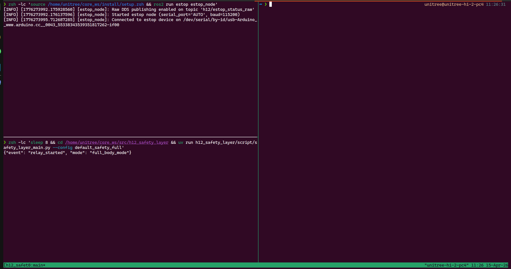
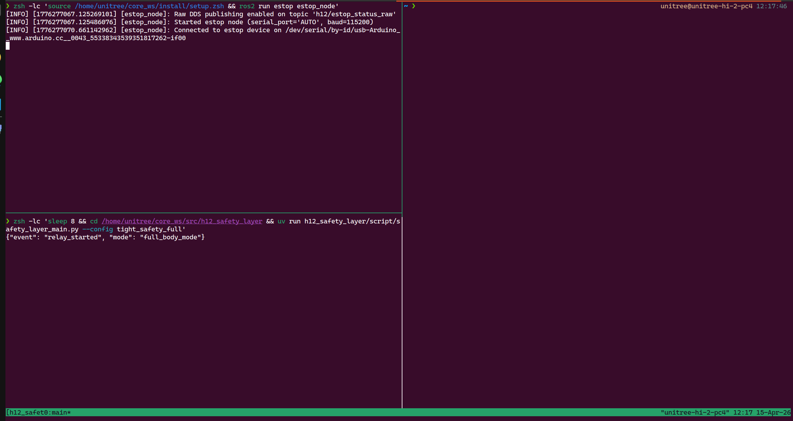
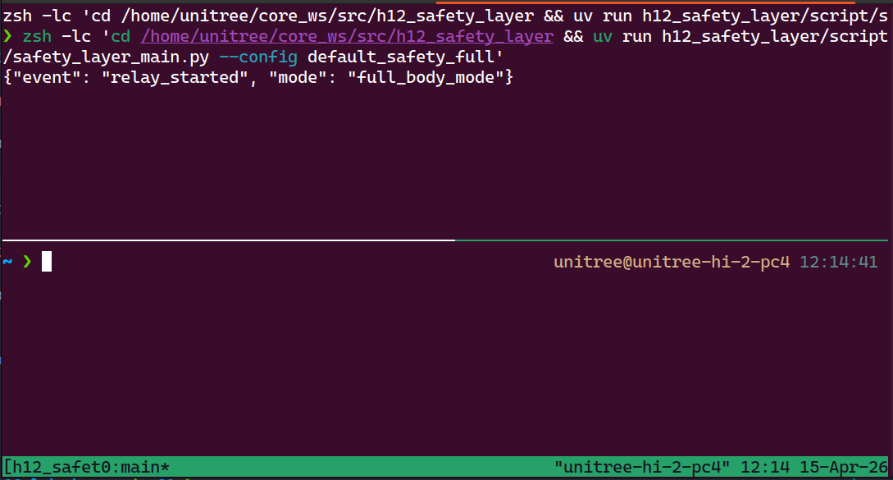
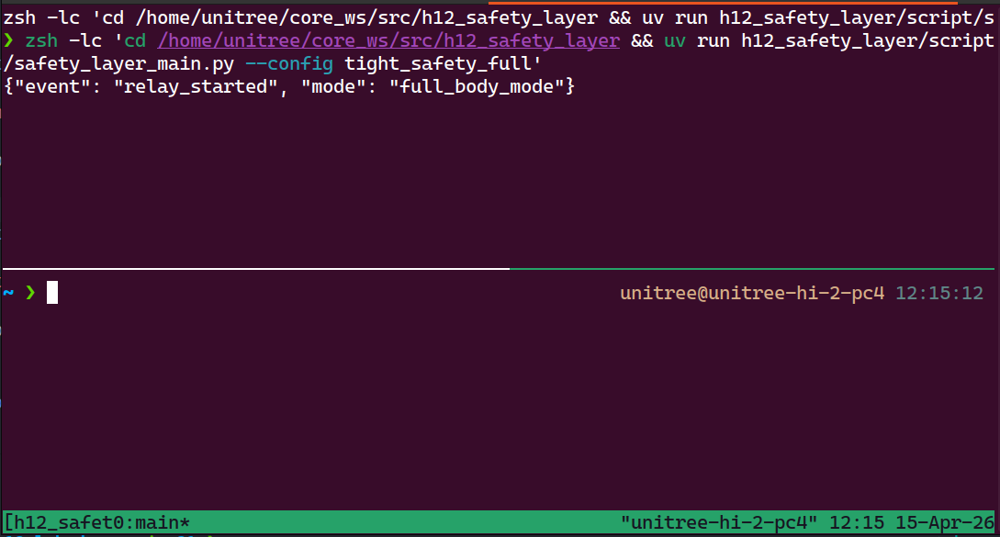

# Safety Layer

[Back to README.md](../README.md)

## Quick Summary

- Mode names: full-body mode and split mode.
    - Full-body mode: publish to topic `rt/safety/lowcmd_in`.
    - Split mode: publish to topic `rt/safety/lowcmd_lower_in` for lower-body, `rt/safety/lowcmd_upper_in` for upper-body.
- Profiles: default safety and tight safety.
- Variants: estop, no-estop, and estop plus upper-body controller.
- More information in the [safety repo](https://github.com/correlllab/h12_safety_layer).

For each mode below, run the listed script on the humanoid.

## Safety Layer with Estop Button

### Default safety profile

- Full-body mode: `~/scripts/start_estop_default_safety_full.sh`
- Split mode: `~/scripts/start_estop_default_safety_split.sh`

### Tight safety profile

- Full-body mode: `~/scripts/start_estop_tight_safety_full.sh`
- Split mode: `~/scripts/start_estop_tight_safety_split.sh`

## Safety Layer without Estop Button

### Default safety profile

- Full-body mode: `~/scripts/start_noestop_default_safety_full.sh`
- Split mode: `~/scripts/start_noestop_default_safety_split.sh`

### Tight safety profile

- Full-body mode: `~/scripts/start_noestop_tight_safety_full.sh`
- Split mode: `~/scripts/start_noestop_tight_safety_split.sh`

## Safety Layer with Estop Button & Upper-Body Controller

- Full-body mode: `~/scripts/start_controller_safe_full.sh`
- Split mode: `~/scripts/start_controller_safe_split.sh`
