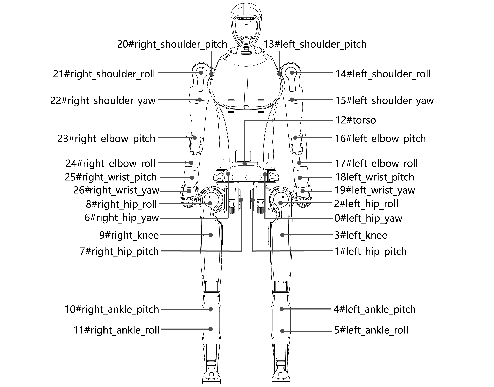

# Motors and Joints

---

### Motor Parameters

| Motor Model | Speed Ratio | Torque (Nm) | Rotor Moment of Inertia (×10⁻¹ kg·m²) | Output Total Equivalent Moment (kg·m²) | Joints Number |
| --- | --- | --- | --- | --- | --- |
| N7520-14.3 | 14.3 | 75 | 0.489 | 0.1017752 | 22, 15, 10, 11, 4, 5 |
| N7520-22.5 | 22.5 | 120 | 0.489 | 0.025101925 | 20, 21, 13, 14, 23, 16 |
| M107-15 | 15 | 200 | 2.71 | 0.063259741 | 12, 6, 0 |
| M107-24 | 24 | 300 | 2.71 | 0.160478022 | 7, 8, 9, 1, 2, 3 |
| N5020-16 | 16 | 25 | 0.139 | 0.003609725 | 26, 24, 25, 17, 18, 19 |

### Joint Names & Limits

| Joint Number | Joint Name | Limits |
| --- | --- | --- |
| 20 | right_shoulder_pitch | -1.57~+3.14 rad |
| 21 | right_shoulder_roll | -3.4~+0.38 rad |
| 22 | right_shoulder_yaw | -2.66~+3.01 rad |
| 23 | right_elbow_pitch | -1.6~+2.53 rad |
| 24 | right_elbow_roll | -2.967~+2.967 rad |
| 25 | right_wrist_pitch | -0.471~+0.349 rad |
| 26 | right_wrist_yaw | -1.012~+1.012 rad |
| 13 | left_shoulder_pitch | -3.14~+1.57 rad |
| 14 | left_shoulder_roll | -0.38~+3.4 rad |
| 15 | left_shoulder_yaw | -3.01~+2.66 rad |
| 16 | left_elbow_pitch | -2.53~+1.6 rad |
| 17 | left_elbow_roll | -2.967~+2.967 rad |
| 18 | left_wrist_pitch | -0.471~+0.349 rad |
| 19 | left_wrist_yaw | -1.012~+1.012 rad |
| 12 | torso | -3.14~+1.57 rad |
| 6 | right_hip_yaw | -0.43~+0.43 rad |
| 7 | right_hip_pitch | -3.14~+2.5 rad |
| 8 | right_hip_roll | -3.14~+0.43 rad |
| 9 | right_knee | -0.26~+2.05 rad |
| 10 | right_ankle_pitch | -0.897334~+0.523598 rad |
| 11 | right_ankle_roll | -0.261799~+0.261799 rad |
| 0 | left_hip_yaw | -0.43~+0.43 rad |
| 1 | left_hip_pitch | -3.14~+2.5 rad |
| 2 | left_hip_roll | -0.43~+3.14 rad |
| 3 | left_knee | -0.26~+2.05 rad |
| 4 | left_ankle_pitch | -0.897334~+0.523598 rad |
| 5 | left_ankle_roll | -0.261799~+0.261799 rad |

---